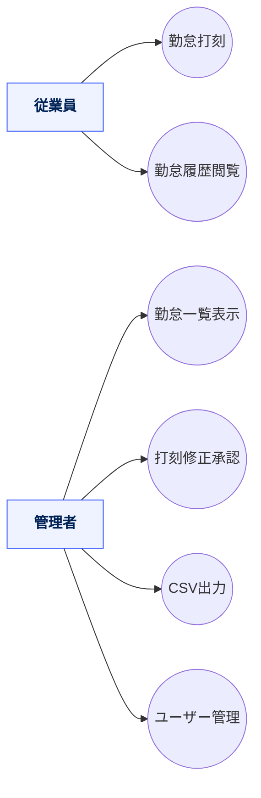
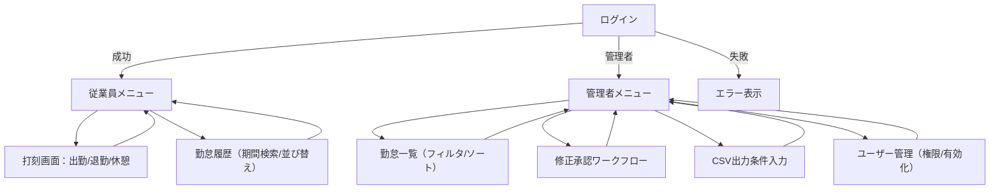
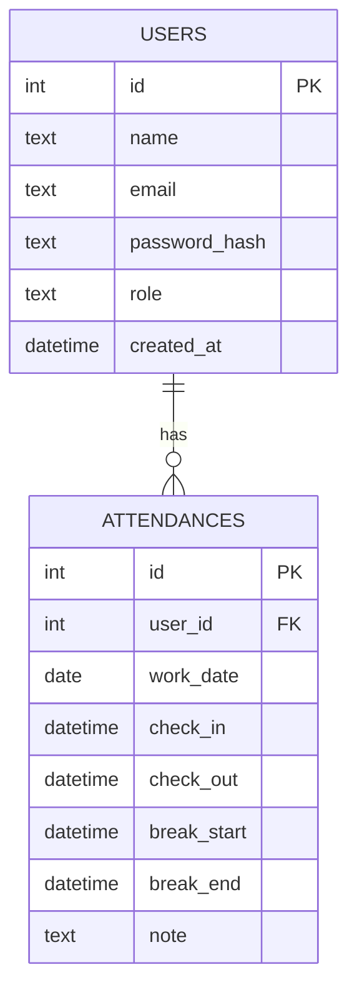
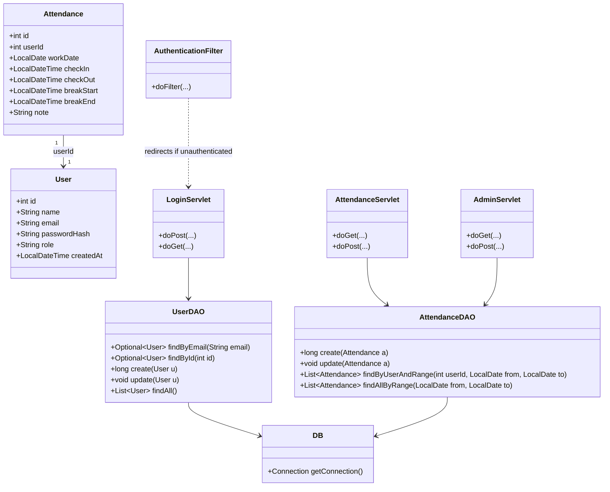

# AttendanceApp（前期版）— 勤怠管理ミニシステム

従業員の **出勤／退勤／休憩の打刻**、**履歴の閲覧**、管理者による **一覧・修正承認・CSV 出力** を行う学習用 Web アプリです。  
Jakarta Servlet (Servlet 5) + JSP をベースに、Eclipse での学習や演習に最適化しています。

> **注**: 本 README は公開リポジトリ構成（Java/CSS 比率、Eclipse プロジェクト）と一般的な前期カリキュラム要件に沿って作成したテンプレートです。実装クラス名・パスが異なる場合は適宜読み替えてください。

---

## 目次

- [機能](#機能)
- [アーキテクチャ](#アーキテクチャ)
- [ディレクトリ構成](#ディレクトリ構成)
- [セットアップと起動](#セットアップと起動)
- [ユーザーストーリー](#ユーザーストーリー)
- [ユースケース図（Mermaid）](#ユースケース図mermaid)
- [画面遷移図（Mermaid）](#画面遷移図mermaid)
- [ER 図（Mermaid）](#er-図mermaid)
- [クラス図（Mermaid）](#クラス図mermaid)
- [クラス設計表（責務・主要メソッド）](#クラス設計表責務主要メソッド)
- [用語辞書](#用語辞書)
- [ライセンス](#ライセンス)

---

## 機能

**従業員**
- 出勤／退勤／休憩開始／休憩終了の打刻
- 自分の勤怠履歴の検索・閲覧（期間・並び替え）

**管理者**
- 全社員の勤怠一覧（フィルタ／ソート）
- 打刻修正依頼の承認
- CSV 出力（期間・部署などの条件付き想定）

---

## アーキテクチャ

- **言語／ランタイム**: Java（Jakarta Servlet 5 互換）
- **ビュー**: JSP + JSTL + CSS
- **DB**: PostgreSQL（サンプル SQL 付）
- **構成**: Model（Entity） / DAO / Servlet（Controller） / Filter（Auth） / JSP（View）

---

## ディレクトリ構成

> 代表的な構成（Eclipse Dynamic Web Project / `src/main` 配下）

```text
src/
└─ main
   ├─ java/
   │  └─ com/example/attendance/
   │     ├─ entity/
   │     │  ├─ User.java
   │     │  └─ Attendance.java
   │     ├─ dao/
   │     │  ├─ UserDAO.java
   │     │  └─ AttendanceDAO.java
   │     ├─ servlet/
   │     │  ├─ LoginServlet.java
   │     │  ├─ AttendanceServlet.java
   │     │  └─ AdminServlet.java
   │     ├─ filter/
   │     │  └─ AuthenticationFilter.java
   │     └─ util/
   │        └─ DB.java            // DataSource/接続ユーティリティ想定
   └─ webapp/
      ├─ WEB-INF/
      │  ├─ web.xml
      │  └─ views/                // JSP
      │     ├─ login.jsp
      │     ├─ menu_employee.jsp
      │     ├─ menu_admin.jsp
      │     ├─ attendance_list.jsp
      │     └─ attendance_history.jsp
      ├─ style.css
      └─ index.jsp
```

## セットアップと起動
1) 事前準備

- Java 17 以上（推奨）
- Tomcat 10.1+ または Jetty 11+（Jakarta 名前空間対応）
- PostgreSQL 15+（サンプルでは attendance_db を使用）

2) DB 初期化（サンプル）
```text
-- DB 作成
CREATE DATABASE attendance_db;

-- ユーザー作成（必要に応じて）
CREATE USER attendance_app WITH PASSWORD 'password';
GRANT ALL PRIVILEGES ON DATABASE attendance_db TO attendance_app;

-- スキーマ
CREATE TABLE users (
  id SERIAL PRIMARY KEY,
  name TEXT NOT NULL,
  email TEXT UNIQUE NOT NULL,
  password_hash TEXT NOT NULL,
  role TEXT NOT NULL DEFAULT 'EMPLOYEE',
  created_at TIMESTAMP NOT NULL DEFAULT NOW()
);

CREATE TABLE attendances (
  id SERIAL PRIMARY KEY,
  user_id INTEGER NOT NULL REFERENCES users(id),
  check_in TIMESTAMP,
  check_out TIMESTAMP,
  break_start TIMESTAMP,
  break_end TIMESTAMP,
  work_date DATE NOT NULL DEFAULT CURRENT_DATE,
  note TEXT
);

-- 管理者の作成例（パスワードはハッシュ化して入れる想定）
INSERT INTO users (name, email, password_hash, role)
VALUES ('管理者', 'admin@example.com', '{BCRYPT_HASH_HERE}', 'ADMIN');
```

3) 接続設定

- DAO（または環境変数）で接続情報を設定:
```text
JDBC_URL=jdbc:postgresql://localhost:5432/attendance_db
DB_USER=attendance_app
DB_PASSWORD=password
```

4) 実行

### Eclipse + Tomcat
#### プロジェクトを “Dynamic Web Project” としてインポート → Tomcat にアタッチ → http://localhost:8080/ へアクセス

### Jetty（任意）
#### jetty-maven-plugin を設定済みなら:
```text
mvn jetty:run
# → http://localhost:8080/
```

## ユーザーストーリー

- 従業員として、スマホからワンタップで打刻したい。残業時間や出勤日数を自分で確認したい。
- 管理者として、全社員の勤怠状況を素早く把握し、修正依頼を承認して、月次 CSV を出力したい。

## ユースケース図


## 画面遷移図


## ER 図


## クラス図


## クラス設計表（責務・主要メソッド）
| クラス                    | 役割（責務）                | 主要メソッド                                   | 共同作業相手                                    |
| ---------------------- | --------------------- | ---------------------------------------- | ----------------------------------------- |
| `User`                 | ユーザーのドメインモデル          | getter/setter                            | `UserDAO`                                 |
| `Attendance`           | 勤怠レコードのドメインモデル        | getter/setter                            | `AttendanceDAO`                           |
| `UserDAO`              | `users` への永続化         | `findByEmail`, `create`, `findAll`       | `DB`, `LoginServlet`                      |
| `AttendanceDAO`        | `attendances` への永続化   | `create`, `update`, `findByUserAndRange` | `DB`, `AttendanceServlet`, `AdminServlet` |
| `DB`                   | JDBC 接続提供（DataSource） | `getConnection`                          | すべての DAO                                  |
| `AuthenticationFilter` | 未ログインアクセスの遮断          | `doFilter`                               | すべての Servlet                              |
| `LoginServlet`         | 認証・セッション開始            | `doPost`, `doGet`                        | `UserDAO`, `AuthenticationFilter`         |
| `AttendanceServlet`    | 従業員機能（打刻/履歴）          | `doGet`, `doPost`                        | `AttendanceDAO`                           |
| `AdminServlet`         | 管理者機能                 | `doGet`, `doPost`                        | `AttendanceDAO`, `UserDAO`                |

## 用語辞書
| 用語       | 意味                            |
| -------- | ----------------------------- |
| 打刻       | 出勤・退勤・休憩開始・休憩終了を時刻として記録すること   |
| 勤怠履歴     | 特定ユーザーの過去の打刻記録（期間・並び替え可）      |
| 修正承認     | 従業員が申請した打刻の修正を管理者が承認する運用      |
| CSV 出力   | 指定期間の勤怠データをダウンロード用 CSV に変換    |
| 役割（role） | `EMPLOYEE` / `ADMIN` といった権限区分 |

## ライセンス
### 教育目的のサンプル。必要に応じてプロジェクト方針に合わせて追記してください。
